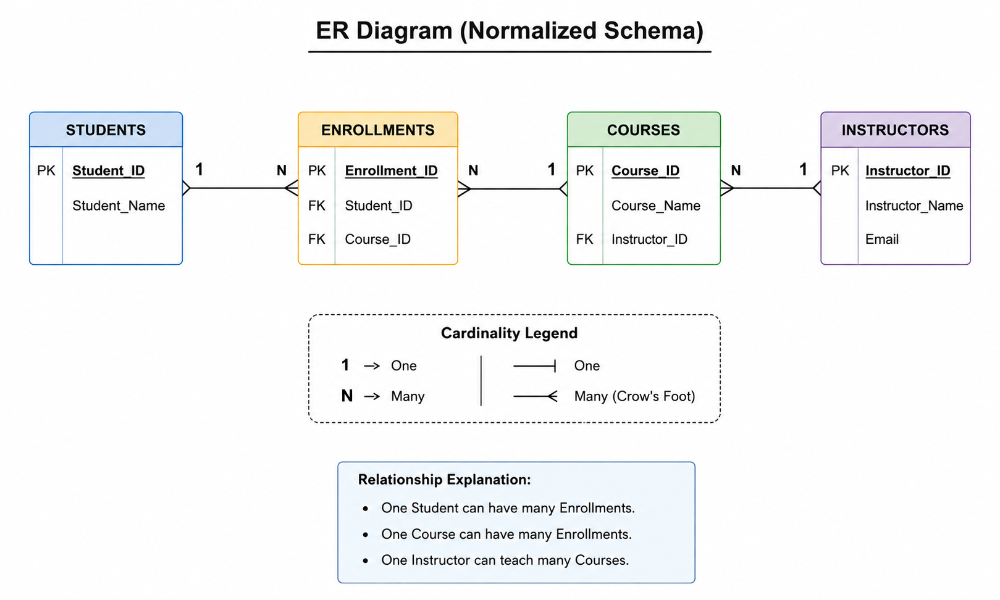

# Database Normalization Report (DB02)

## Upto-Skills AI/ML Internship

### Intern Details

- **Intern Name:** Purshottam Rakesh
- **Task ID:** DB02
- **Supervisor:** Kashish Gajbhiye
- **Topic:** Database Anomalies and Normalization

---

# Project Overview

This project demonstrates the concept of Database Normalization using a Student Course Enrollment system.

The report explains:

- Database Anomalies
- First Normal Form (1NF)
- Second Normal Form (2NF)
- Third Normal Form (3NF)
- ER Diagram
- SQL Implementation
- Normalized Database Design

---

# Objectives

- Understand database redundancy
- Identify Update, Insert and Delete anomalies
- Apply normalization techniques
- Improve database integrity
- Design a normalized relational database

---

# Technologies Used

- SQL
- Relational Database Concepts
- ER Modeling
- Database Normalization

---

# Repository Structure

DB02-Database-Normalization/
│
├── README.md
├── LICENSE
├── normalization.sql
├── ER_Diagram.png
├── Task_ID_DB02_Purushottam_Rakesh_Normalization_Report.docx
└── Task_ID_DB02_Purushottam_Rakesh_Normalization_Report.pdf

# Database Anomalies

- Update Anomaly
- Insert Anomaly
- Delete Anomaly

---

# Normal Forms Covered

✅ First Normal Form (1NF)

✅ Second Normal Form (2NF)

✅ Third Normal Form (3NF)

---

# SQL Implementation

The repository contains SQL scripts to create the normalized database schema.

Location:

```
sql/normalization.sql
```

---

## ER Diagram

The following Entity Relationship (ER) Diagram represents the final normalized database schema.



# Learning Outcomes

After completing this task, I understood:

- Database Normalization
- Database Design
- Primary Keys
- Foreign Keys
- Data Integrity
- Database Relationships

---

# Author

Purshottam Rakesh

Upto-Skills AI/ML Internship

Task ID: DB02
